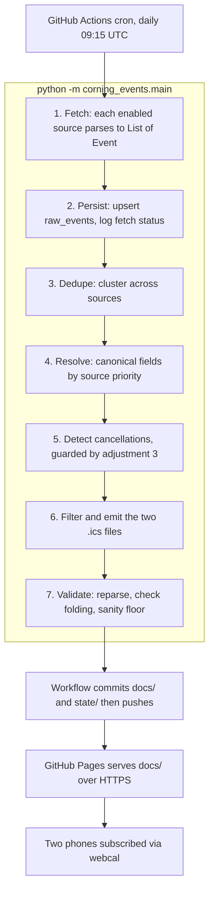

Plan: Corning Events iCal Aggregator
===============================================================================

> Status: Underway

M0, M1 and M2 are complete. Implementation continues at M3, deduplication.

One source is blocked: ssclibrary is behind a Cloudflare bot challenge. See M2
below and the owner action items in Part 4.

| Milestone | Description | State |
|---|---|---|
| M0 | Scaffold and config | Complete |
| M1 | Core plumbing: model, state, normalize, emitter | Complete |
| M2 | Tier A sources | Complete, except ssclibrary |
| M3 | Dedupe and persistence integration | Not started |
| M4 | End to end feeds and publish surface | Not started |
| M5 | Tier B scrapers | Not started |
| M6 | GitHub Actions and Pages | Not started |

---

## Context

The goal is a background service that aggregates public leisure events around
Corning, New York and publishes subscribable iCal feeds for two people, the
repository owner and their partner.

An earlier session produced a thorough source specification, now at
`plans/spec/corning-events-source-spec.md`. That is the authority on source
details: URLs, formats, record counts, and known quirks. This plan is the
authority on architecture and sequencing. Where the two conflict, this plan
wins, and Part 1 records every such conflict explicitly.

Read spec sections 4, 9, 10 and 11 in full before implementing.

**Decisions already made. Do not re-open these:**

- Runtime and hosting: GitHub Actions scheduled workflow plus GitHub Pages.
- V1 scope: all Tier A sources plus four Tier B scrapers, being the Chamber of
  Commerce, Corning Museum of Glass, Rockwell Museum and Gaffer District.
- Cadence: daily fetch and regenerate. The owner originally proposed weekly and
  agreed to daily on the strength of spec section 11.
- The FLXcalendar curator will not be contacted. Poll politely, meaning one GET
  per day with a descriptive User-Agent, and carry per-event attribution
  regardless.

---

## Part 1: Spec critique and adjustments

The source spec is strong. Sources are verified with dates, data distributions
are measured rather than estimated, the iCal semantics are correct on the
points that matter (UID stability, SEQUENCE, exclusive DTEND, octet folding),
and the treatment of robots and etiquette is honest.

The following adjustments are binding and override the spec where they
conflict.

**1. Relax the standard-library-only constraint (spec section 14).**
The spec mandates stdlib-preferred Python, then in section 9.2 requires
hand-rolling RFC 5545 emission (75-octet folding, escaping, CRLF), and in
sections 3.2 and 3.3 introduces two Tribe `.ics` feeds that the stdlib cannot
parse at all. Hand-rolled iCal is the single highest silent-failure risk in the
project, and the spec itself observes that invalid iCal fails silently.
*Adjustment:* allow this fixed dependency set and no more: `requests`,
`icalendar` (used both to parse the Tribe feeds and to emit output),
`python-dateutil` (RRULE expansion), `beautifulsoup4` with `lxml` (Tier B
scraping), and `pytest` (development only). The xCal parse still uses stdlib
`xml.etree.ElementTree` exactly as the spec specifies.

**2. The spec requires a state store but never specifies one.**
Cancellation detection by diffing consecutive pulls, SEQUENCE increments,
`first_seen` and `last_seen`, and stable published UIDs across runs all need
persistence between daily runs. *Adjustment:* a single SQLite file using stdlib
`sqlite3`, committed back to the repository by the workflow after each run.
Schema appears in Part 2.

**3. Source-outage protection is missing, and its absence is dangerous.**
Under the spec's rule, a UID that disappears while its start is still in the
future is presumed cancelled. A single failed fetch, or a source that returns an
empty page after a redesign, would therefore mass-cancel every event from that
source on both subscribers' phones. *Adjustment:* cancellation logic runs for a
source only when that source's fetch succeeded and returned at least one event.
On failure or an empty result, retain the previous run's events for that source
untouched, record the failure in `fetch_log`, and print a warning. If
FLXcalendar specifically fails three consecutive runs, exit nonzero so GitHub
emails the owner.

**4. Drop Burbio from v1 (spec section 3.5).**
Its chief unique contribution is school district events. The subscribers are two
adults rather than a household with school-age children, and Burbio overlaps the
library feed. Its subscription URL may also require an account, which is
unverified. Revisit only on request.

**5. Two feeds, not four (spec section 9.1).**
Four variants for two subscribers is overkill. *Adjustment:* emit
`corning-core.ics`, carrying the Core and Near rings across all categories and
serving as the default subscription, and `flx-all.ics`, carrying everything
within fifty miles. Category feeds remain a cheap later addition because
filtering is driven entirely by config.

**6. UID stability needs a rule the spec does not state, namely cluster-level
pinning.**
Deduplication merges records from several sources into one published event. If
the winning source changes between runs, a UID derived from that winner changes
too, and every subscriber gets a duplicate. *Adjustment:* the published UID is
minted the first time a cluster appears, as `sha1(source_id + ':' + source_uid)`
of the record that created the cluster, suffixed `@corning-events`, and is then
persisted forever regardless of which source later wins field resolution.

**7. Robots posture.**
The FLXcalendar export host `timelyapp.time.ly` disallows automated access in
robots.txt (spec section 11). The owner has decided to proceed: one GET per day
carrying the User-Agent
`CorningEventsAggregator/1.0 (+https://github.com/DaveKT/corning_events)`.
If that endpoint begins blocking, fall back to the `.ics` export on
`calendar.time.ly`, which permits access, and parse it with `icalendar` instead
of the xCal path.

**8. Minor points.**
(a) The spec says "family members"; the audience is two adults. Cosmetic only.
(b) With daily regeneration, keep `REFRESH-INTERVAL` at PT12H as specified. It
is harmless.
(c) Timezone: take the spec's simpler option and emit timed events in UTC with a
trailing `Z`, authoring no VTIMEZONE. Use stdlib `zoneinfo` for the
America/New_York to UTC conversion.
(d) Worth a ten minute probe during M5: the Chemung County Historical Society may
expose a Tribe iCal endpoint at
`https://chemungvalleymuseum.org/?post_type=tribe_events&ical=1&eventDisplay=list`.
If it returns valid iCal it is a free Tier A source.

---

## Part 2: Architecture



The repository is public, which free GitHub Pages requires. Per spec section 9.4
the feed URL is public regardless, and nothing private goes into a feed.

### Directory naming warning

`docs/` is not documentation. It is the GitHub Pages web root, and everything
inside it is build output. Never hand-edit it, and never put a plan or a
reference document there. The name is fixed because branch-based GitHub Pages
serves only from the repository root or from `/docs`.

Hand-written documentation lives under `plans/`: development plans at its top
level, and reference material such as the source spec in `plans/spec/`.

### Repository layout

```
corning_events/
  README.md
  pyproject.toml            pytest config only. The project is not installed
  requirements.txt          requests, icalendar, python-dateutil,
                            beautifulsoup4, lxml
  requirements-dev.txt      pytest
  CLAUDE.md
  plans/
    2026-08-corning-events-ical-aggregator.md
    archive/                completed plans
    spec/
      corning-events-source-spec.md
  corning_events/
    __init__.py
    config.py               all knobs: rings, city to ring map, category map,
                            feed definitions, source toggles, User-Agent
    model.py                Event dataclass mirroring spec section 8
    state.py                SQLite open, migrate, upsert, query
    http.py                 session with UA, timeout, retry and backoff
    normalize.py            HTML to text, title normalization, tz conversion,
                            " @ " venue split
    dedupe.py               match cascade, clustering, field resolution
    feeds.py                filtering, VEVENT assembly, emission, validation
    main.py                 orchestrator. CLI: --sources, --dry-run, --db
    sources/
      __init__.py           FETCHERS registry mapping source_id to fetch fn
      base.py               the fetch contract, plus shared helpers
      flxcalendar.py        xCal via ElementTree.iterparse, spec section 4.6
      ssclibrary.py         Tribe .ics via icalendar
      clemenscenter.py      Tribe .ics via icalendar
      ticketmaster.py       Discovery API JSON
      chamber.py            ChamberMaster ?rendermode=print HTML
      cmog.py               Drupal HTML, whatson.cmog.org
      rockwell.py           WordPress /events/{slug} detail pages
      gaffer.py             Simpleview /events/ subtree
  tests/
    fixtures/               one saved raw capture per source
    test_normalize.py  test_dedupe.py  test_feeds.py  test_sources.py
  docs/                     GitHub Pages root, generated
    index.html  corning-core.ics  flx-all.ics
  state/
    events.db               committed, carries cross-run state
  .github/workflows/daily.yml
```

### Event model

The dataclass mirrors the spec section 8 canonical model exactly: `event_id`,
`source_id`, `source_uid`, `title`, `description`, `start`, `end`, `all_day`,
`venue_name`, `address`, `lat`, `lon`, `city_tag`, `county_tag`, `categories`,
`cost`, `ticket_url`, `source_url`, `original_url`, `recurrence_parent_id`.
All fields are nullable except `source_id`, `source_uid`, `title` and `start`.
Datetimes are stored as UTC ISO-8601 strings in SQLite.

### SQLite schema

```sql
CREATE TABLE IF NOT EXISTS raw_events (      -- one row per source occurrence
  source_id TEXT NOT NULL,
  source_uid TEXT NOT NULL,                  -- recurrences: parent + ':' + date
  payload TEXT NOT NULL,                     -- JSON of the Event dataclass
  first_seen TEXT NOT NULL,
  last_seen TEXT NOT NULL,
  PRIMARY KEY (source_id, source_uid)
);
CREATE TABLE IF NOT EXISTS clusters (        -- published identity, pinned
  cluster_id INTEGER PRIMARY KEY,
  published_uid TEXT NOT NULL UNIQUE,        -- minted once, never regenerated
  member_keys TEXT NOT NULL                  -- JSON list of source_id:source_uid
);
CREATE TABLE IF NOT EXISTS published (       -- what the last feed contained
  published_uid TEXT PRIMARY KEY,
  sequence INTEGER NOT NULL DEFAULT 0,
  content_hash TEXT NOT NULL,                -- excludes DTSTAMP and SEQUENCE
  status TEXT NOT NULL DEFAULT 'CONFIRMED',  -- or CANCELLED
  cancelled_at TEXT                          -- drives 30 day retention
);
CREATE TABLE IF NOT EXISTS fetch_log (
  source_id TEXT NOT NULL, run_at TEXT NOT NULL,
  ok INTEGER NOT NULL, event_count INTEGER NOT NULL, note TEXT
);
```

### Key algorithms

**Recurrence expansion, in `flxcalendar.py`.**
Expand at parse time into one Event per occurrence, settling spec section 15
question 2 in favour of expansion. RDATE values become occurrences directly.
RRULE expands through `dateutil.rrule.rrulestr`, bounded to the window from now
to twelve months out. EXDATE is honoured. The `source_uid` of an occurrence is
the parent UID plus `:` plus the occurrence start date as YYYYMMDD, and
`recurrence_parent_id` holds the parent UID.

**Deduplication, in `dedupe.py`.**
This implements the spec section 10 cascade with concrete thresholds. Bucket
candidates by start date first, which is both cheap and correct, then compare
only within a bucket. Cascade, strongest signal first:

1. Equal non-null `original_url`, compared after stripping the query string and
   any trailing slash.
2. Same normalized title, same start date, and same normalized venue.
3. Same start datetime, same normalized venue, and
   `difflib.SequenceMatcher.ratio() >= 0.85` on normalized titles.
4. Same start datetime, haversine distance under 150 metres, and ratio at or
   above 0.85.

Title normalization lowercases, strips punctuation, collapses whitespace, and
removes both a leading venue-name prefix and a trailing `@ <venue>` fragment.
Venue normalization lowercases and strips punctuation. Clusters form by
union-find. Field resolution follows the spec section 10 trust order: the
venue's own site (`cmog`, `rockwell`, `clemenscenter`, `gaffer`), then
`chamber`, then `flxcalendar`, then the tourism boards, then `ticketmaster`,
then everything else. Ties break toward the record with the most non-null
fields.

**Ring classification, in `config.py` and `normalize.py`.**
Apply these tests in order and stop at the first that resolves:

1. The FLXcalendar `x-tags` city tag, looked up in a static city-to-ring map
   built from the spec section 1 table. Core covers Corning, Painted Post,
   Riverside, Gang Mills, Erwin, Big Flats and Horseheads. Near covers Elmira,
   Bath, Watkins Glen and Addison. Regional covers Hammondsport, Ithaca, Penn
   Yan, Trumansburg, Owego, Montour Falls, Hornell, Geneva, Hector and Seneca
   Lake.
2. Haversine distance from the anchor at 42.1481, -77.0569 when lat and lon are
   present.
3. The source's default ring. The library, museum, chamber and gaffer sources
   default to Core; Clemens Center defaults to Near.
4. The county tag. Steuben and Chemung map to Near; Tompkins, Schuyler, Yates,
   Seneca and Tioga map to Regional.
5. Anything still unresolved becomes Regional, which keeps it in `flx-all.ics`
   only.

Anything measured beyond fifty miles is excluded entirely.

**Cancellation, in `main.py`, subject to adjustment 3.**
For each source whose fetch succeeded and returned at least one event, any
`raw_events` row from that source whose `last_seen` predates this run and whose
`start` is still in the future is stale. A cluster is cancelled only when every
member row is stale. A cancelled cluster is emitted with `STATUS:CANCELLED` and
an incremented SEQUENCE, has `cancelled_at` set, and leaves the feed thirty days
later. Nothing is ever cancelled off the back of a failed or empty fetch.

**Emission, in `feeds.py`.**
Filter to events that are not both cancelled and past retention, whose start
falls between one day ago and twelve months out, and whose ring matches the feed
definition. Newly appearing events must have a future start. Build the calendar
with the `icalendar` library, which handles folding, escaping and CRLF. Calendar
properties follow the spec section 9.2 block, with PRODID
`-//corning-events//Corning Events Aggregator//EN` and X-WR-CALNAME of either
`Corning Area Events` or `FLX All Events`. Each event carries UID (the pinned
`published_uid`), DTSTAMP at run time in UTC, DTSTART and DTEND in UTC with a
trailing `Z` or as `VALUE=DATE` with exclusive DTEND for all-day events,
SUMMARY, DESCRIPTION as plain text ending in an attribution line reading
`Source: <source name> - <url>` per spec section 9.4, LOCATION as
`venue_name, address`, URL preferring `original_url` then `ticket_url` then
`source_url`, GEO where available, CATEGORIES, SEQUENCE and STATUS. SEQUENCE
increments only when the recomputed content hash differs from the stored one.
Events whose title is the literal string `None` are dropped, per spec section
4.6 issue 1.

**Validation, in `feeds.py`, run before anything is written.**
Reparse each emitted file with `icalendar` and require event count parity.
Assert every line is at most 75 octets and that endings are CRLF. Assert every
VEVENT carries UID, DTSTAMP, DTSTART and SUMMARY. Apply a sanity floor: if
`corning-core.ics` would contain fewer than five events, abort without
overwriting the existing files and exit nonzero.

---

## Part 3: Implementation milestones

Execute in order. Each milestone ends when its own verification passes. Commit
once per milestone.

### M0: Scaffold (Complete)

The layout above exists, with `config.py` carrying the anchor coordinates, ring
tables, source registry, feed definitions, User-Agent, horizon and retention
windows. Every other module is a docstring stub naming the milestone that fills
it in. All eight sources are registered with `enabled=False`; each milestone
switches on the sources it implements.

Two decisions were taken during implementation that the plan had left open.

**Packaging.** M0 used a `src/` layout with an editable install. M1 abandoned
both. See the M1 notes below for why; the package now sits at the repository
root and nothing is installed. Homebrew Python is externally managed under
PEP 668, so a `.venv` is still required locally.

**Registry naming.** The fetch function registry in `sources/__init__.py` is
called `FETCHERS`, not `SOURCES`, so that it is never confused with
`config.SOURCES`, which holds the `SourceConfig` metadata. The two are held in
step by a test.

M0 also ships thirteen tests rather than the zero the milestone strictly
required. They cover the seams where later milestones are most likely to drift:
a source module without a matching `SourceConfig`, a mistyped ring name, a
category alias pointing at a name that does not exist, and feed definitions
that overlap or reference invalid rings.

*Verified:* `pytest` reports 13 passed, and `python -m corning_events.main
--dry-run` reports that no sources are enabled and exits zero.

### M1: Core plumbing (Complete)

`model.py`, `state.py`, `normalize.py` and `feeds.py` are implemented and
covered by 109 tests.

Four decisions were taken during implementation.

**The `src/` layout and the editable install were both abandoned.** The
editable install failed silently on this machine: pip writes files into
site-packages carrying the macOS `UF_HIDDEN` flag, and Python's `site.py`
deliberately skips hidden `.pth` files, so the editable path entry was never
applied and every import failed with a bare `ModuleNotFoundError`. The package
now sits at the repository root and nothing is installed at all, which removes
the failure mode outright and keeps local and CI behaviour identical.
`pyproject.toml` survives carrying only pytest configuration.

**`Event` omits the spec's `event_id`.** `(source_id, source_uid)` is already
the primary key in the state store, so a second identifier would be dead
weight. `Event.key` returns the pair as one string where that is convenient.

**`Event.end` is always the exclusive end**, matching RFC 5545, for timed and
all-day events alike. Storing an inclusive end would have put the conversion
in the emitter, far from the source module that actually knows which
convention its feed uses. `model.all_day_bounds` takes an inclusive last day
and returns the exclusive bounds, so the easy path is the correct one. The
dataclass enforces UTC and rejects an end at or before its start.

**Two source configs now declare `default_ring = None`.** The ring cascade
consults the source default before the county tag, so a default on every
source would have made the county and fallback steps unreachable. FLXcalendar
and Ticketmaster are regional aggregators with no meaningful default, so they
decline to guess and the cascade continues past them.

Worth knowing for M2: `REFRESH-INTERVAL` is a known DURATION property and
`icalendar` wants a `timedelta`, while `X-PUBLISHED-TTL` is an X- property
with no registered type and needs the literal string `PT12H`, or it serializes
as `12:00:00`. Both derive from `config.REFRESH_INTERVAL_HOURS`.

*Verified:* `pytest` reports 109 passed. A hand-built sample feed carrying a
timed event, a multi-day all-day event and a cancelled event emits correct
`VALUE=DATE` bounds with an exclusive DTEND, folds a 500 character description
and a multi-byte one within 75 octets, and reparses field for field.

### M2: Tier A sources (Complete, except ssclibrary)

Three of the four Tier A sources are implemented, enabled and verified against
live data on 2026-08-09. A full run fetches 460 events: 443 from FLXcalendar
and 17 from Clemens Center, distributed 116 Core, 139 Near, 205 Regional.

**ssclibrary is blocked.** The host answers any non-browser request with a
Cloudflare bot challenge and a 403. Getting past that would mean impersonating
a browser to defeat a protection the site owner deliberately enabled, which is
not something to do quietly on their infrastructure. The parser is written and
tested, and the source is registered but disabled, so enabling it is a one line
change once access is arranged. See Part 4 for the options.

**Ticketmaster is unverified against live data.** No API key was available, so
the parser follows the documented Discovery API v2 schema and its fixture was
built from that schema rather than captured. Every field access is defensive,
so the likely failure mode is silently empty results rather than an exception.
Re-record the fixture the first time a key is present.

Four things differ from what the spec recorded on 2026-07-24, measured against
a fresh export:

**`x-original-url` is empty on all 1503 FLXcalendar records.** Spec section 4.2
lists it at 100 percent coverage and section 10 calls it the best dedupe
signal. It is present as an empty element and carries nothing. Dedupe rule 1
is therefore dead for FLXcalendar and M3 must lean on the title, venue and
time rules. A test pins this, so if the curator ever starts populating it the
test fails and rule 1 becomes available.

**`rrule` is structured XML, not an RRULE string.** Children are `freq`,
`until`, `byday` and `wkst`, reassembled into a string before dateutil can
expand them.

**All-day events exist and the spec's property table omits them.** Around 43
records carry `date` rather than `date-time` values.

**The category vocabulary is 45 labels, not the 30 in spec section 4.5.**
Fifteen were missing, including Cars, Health, Science, Holidays, Teen and
Support, and the spec spells "History and Heritage" where the feed uses an
ampersand. Since unrecognised labels are dropped rather than passed through,
the stale list would have silently discarded them. `CANONICAL_CATEGORIES` now
matches the live vocabulary. Two city tags were also added, Waverly and Keuka
Lake.

Implementation notes worth carrying forward:

- Occurrence `source_uid` values encode the full timestamp, not just the date
  as the plan originally said. A series can legitimately run twice in one day,
  and Timely's own permalinks are keyed the same way.
- Occurrences outside the window from `PAST_WINDOW_DAYS` ago to `HORIZON_DAYS`
  ahead are discarded at parse time. This settles spec section 15 question 1
  in favour of discarding: there is no analytics use for the roughly 1,200
  past records in each export, and keeping them would bloat a database that is
  committed on every run.
- Descriptions are capped at `MAX_DESCRIPTION_CHARS`. Venue feeds pad every
  event with box office hours, share links and visitor information, which is
  unreadable on a phone. The event URL is always emitted.
- Venue-published feeds set `original_url` to their own event URL, since the
  venue is the organizer. That gives dedupe rule 1 something to match on even
  though FLXcalendar cannot supply it.
- Clemens Center signals cancellation in the title, as "CANCELLED - Show Name",
  rather than through STATUS. Spec section 11 says no source publishes
  cancellations; this one does, informally. The title reads correctly to a
  subscriber as is. M4 could optionally map such a prefix onto
  `STATUS:CANCELLED`.

*Verified:* 155 tests pass, all offline against fixtures pinned to a fixed
capture time so counts cannot drift. `python -m corning_events.main --dry-run`
fetches live and reports the counts above. Timezone handling was checked
against event descriptions that state their own local start time.

### M3: Dedupe and persistence

Implement `dedupe.py` per Part 2 and wire pipeline steps 1 through 4 in
`main.py`, upserting `raw_events` and minting or looking up clusters.

Tests cover synthetic fixtures exercising each cascade rule, a museum-style event
present in three sources collapsing to one, and UID pinning surviving a change of
canonical source between two runs.

*Verify:* run twice against fixtures; the second run mints zero new clusters.

### M4: End to end feeds and publish surface

Wire cancellation, filtering and emission, then write `docs/index.html` as a
plain page describing what the feeds are, linking both in `https://` and
`webcal://` form, and carrying the attribution note.

The idempotency test is the critical one: run main twice back to back against
fixtures and require the two `.ics` outputs to be byte-identical except for
DTSTAMP lines, with no SEQUENCE changed. The cancellation test removes one
future-dated fixture record, runs, and asserts `STATUS:CANCELLED` with a SEQUENCE
bump; it then simulates a failed fetch by having a source raise, and asserts that
nothing was cancelled.

*Verify:* import `corning-core.ics` into a calendar client locally and eyeball
ten events for sane times, titles and locations.

### M5: Tier B scrapers

One module each, in the order below, which is highest yield first. Each fetches
its listing pages, parses them, derives a stable `source_uid` from the event
detail URL slug plus the date where the event recurs, and ships with a fixture
and a test. Wrap every source run in try and except so one broken scraper never
kills the pipeline; log the failure to `fetch_log` and continue.

- `chamber.py` against
  `https://www.corningny.com/events?rendermode=print&from=<today>&to=<today+6mo>`.
  Spec section 5 notes print mode is the clean parse target. This is the highest
  single-source yield and it republishes museum, Rockwell, ARTS Council and
  Farmers Market items, so dedupe load rises sharply here. Recheck that the M3
  tests still hold against real data.
- `cmog.py` against `https://whatson.cmog.org/events-programs`, following
  pagination.
- `rockwell.py` against
  `https://rockwellmuseum.org/community-education/events/`, then each
  `/events/{slug}` detail page.
- `gaffer.py`, crawling the `/events/` subtree children listed in spec section 5,
  covering glassfest, harvest, summer in downtown and the farmers market. Low
  volume but it carries long-lead festivals.
- Also run the Chemung Historical Society probe from adjustment 8d. If it returns
  valid iCal, add it as a fourth Tribe-style source reusing the `ssclibrary.py`
  pattern.

*Verify:* a full local run with every source enabled. Inspect the dedupe stats
printed by main, in the form `N raw to M clusters`, and spot check that a museum
event appearing in the chamber, FLXcalendar and museum sources is emitted once.

### M6: GitHub Actions and Pages

Write `.github/workflows/daily.yml` with a `schedule` of cron `15 9 * * *` plus
`workflow_dispatch`. It checks out, sets up Python 3.12, installs requirements,
runs main, then commits `docs/` and `state/` if changed under a bot identity and
pushes. `TICKETMASTER_API_KEY` comes from repository secrets. Set a concurrency
group so runs cannot overlap.

In repository settings, set Pages to serve from branch `main`, folder `/docs`.

*Verify:* trigger through `workflow_dispatch` and confirm the run is green.
Confirm `https://davekt.github.io/corning_events/corning-core.ics` serves valid
iCal and that `index.html` renders. Subscribe on an iPhone through the webcal
link and confirm events appear. Confirm the next scheduled run produces a small
diff carrying DTSTAMP changes and genuinely new events only.

---

## Part 4: Owner action items

These cannot be done by the implementing model.

1. Register at `developer.ticketmaster.com`, which is free and immediate, and add
   the key as the repository secret `TICKETMASTER_API_KEY`. The pipeline runs
   without it; Ticketmaster events simply will not appear. Doing this also
   allows the Ticketmaster parser to be verified against a real response for
   the first time.
2. Decide what to do about the library feed, `ssclibrary`. Its host now answers
   non-browser requests with a Cloudflare bot challenge, so the feed cannot be
   fetched by an honest client and the source ships disabled. Options, roughly
   in order of preference: ask the library to allow the aggregator's
   User-Agent, since they publish the feed for public subscription and the
   request is one GET per day; accept the partial coverage that already comes
   through FLXcalendar and, from M5, the Chamber of Commerce; or reconsider
   Burbio, dropped in Part 1 adjustment 4, which aggregates library calendars.
3. After M6, enable Pages in repository settings if the workflow has not, and
   subscribe on both phones through the webcal links on the index page. On
   Android and Google Calendar, expect multi-hour refresh lag per spec section
   9.3.

---

## Part 5: Overall verification

- Every pytest suite green. Fixtures keep this deterministic and offline.
- Idempotency: two consecutive runs produce byte-identical feeds apart from
  DTSTAMP, with zero SEQUENCE bumps.
- Validity: emitted files reparse with `icalendar`, every line is at most 75
  octets, endings are CRLF. Paste one output into the icalendar.org validator
  manually at least once.
- Real world: the subscription stays live on both phones across a week of daily
  runs with no duplicate events and nothing vanishing without a CANCELLED
  marker.

---

## Style constraints

Taken from spec section 14 and applying to all generated text, documentation and
the published index page: Python; tabular output as CSV and text output as
markdown; no em-dashes and no emoji.
